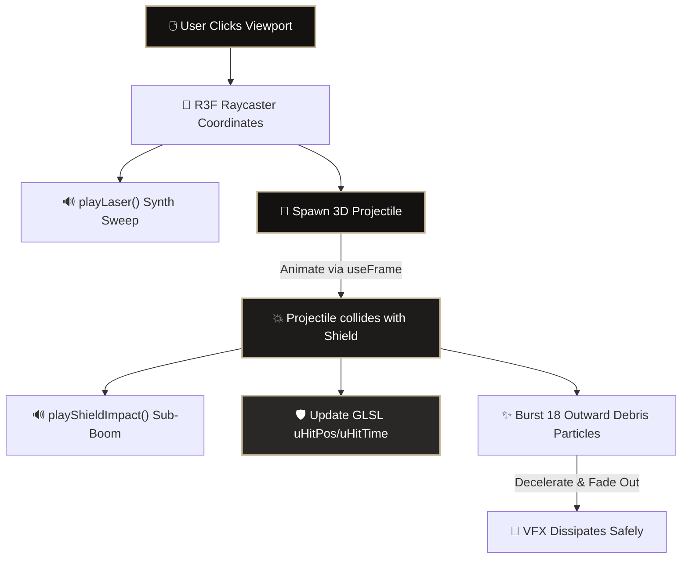

# 🛡️ Aegis HUD

<div align="center">
  
  [](https://nextjs.org/)
  [](https://threejs.org/)
  [](https://github.com/pmndrs/react-three-fiber)
  [](https://www.typescriptlang.org/)
  [](#)

  **A real-time, cinema-grade holographic force shield playground built with React Three Fiber, Three.js, and custom GLSL Shaders.**
  
  *Fully customized with an interactive cyberpunk HUD, spatial synthesizers, click-to-shoot projectiles, and 4K MSAA anti-aliased rendering.*
  
</div>

---

## ✨ Features Spotlight

> [!NOTE]
> Every visual, auditory, and structural aspect of this project is fully parametric and interactive—controllable in real time via the HUD dashboard.

### 🛡️ Core Shader VFX
*   **Hexagonal Grid Projector**: Tri-planar projected grid pattern with random cell flicker, seam-fade blending, and dynamic scaling.
*   **Fresnel Edge Glow**: Camera-relative angle calculations driving dynamic boundary luminance.
*   **Simplex Flow Noise**: Organic surface ripples powered by an optimized custom 2D noise shader.
*   **Dissolve Animation**: Dissolves and materializes through a custom noise mask with bright glowing borders.
*   **Dynamic Health States**: Smooth color interpolation from theme blue to crimson as shield energy depletes.

### 🔊 Procedural Synth Engine
Powered entirely by **Web Audio API**—synthesizing sounds on the fly with *zero* external `.mp3` or `.wav` dependencies:
*   `playLaser()`: Quick pitch glide (sawtooth sweep from 950Hz to 120Hz) over 0.16s.
*   `playShieldImpact()`: Low-frequency sub-bass boom (sine wave sweeping 160Hz to 35Hz) layered with high-pass white noise.
*   `playShieldReveal()`: Ascending triangle oscillator sweep (90Hz to 780Hz) modulated by a 16Hz LFO vibration to simulate charging energy banks.
*   `playPlasma()`: Deep, sub-acoustic heavy anti-matter blast hum.
*   `playEmp()`: Fast, high-frequency high-voltage electricity zaps.

---

## ☄️ Cyberpunk Weapon Selection Chamber

Choose your ammunition from the custom **Weapon System** panel in Leva. Clicking anywhere on the 3D shield fires a raycasted projectile from your camera's origin that synchronizes perfectly with the shader ripple and sound sweeps:

| Weapon Type | Firing Sound | 3D Visual Mesh | Impact Debris | Damage % |
| :--- | :--- | :--- | :--- | :--- |
| **LASER_BOLT** | `playLaser()` | Small White Beam (`0.07`) | 16 Amber Grid Particles | **1x Standard** |
| **PLASMA_BLAST** | `playPlasma()` | Huge Cyan Orb (`0.22`) | 28 Dense Outward Sparks | **2.2x Heavy** |
| **EMP_PULSE** | `playEmp()` | Magenta Lightning Spark (`0.04`) | 14 Rapid Violet Sparks | **0.5x Tactical** |

---

## 📊 Live Interactive Telemetry Flowchart

This diagram illustrates how clicks travel from the viewport and coordinate seamlessly with the Web Audio Synthesizer, 3D physics engines, and GLSL uniforms:



---

## 📺 Diagnostic HUD & Shaders Panel

*   **Oscilloscope Canvas**: The slide-up **Diagnostics Drawer** features a live HTML5 `<canvas>` rendering a real-time, scrolling neon oscilloscope wave syncing with frame rate fluctuations.
*   **Cyber Glitch**: Sporadic visual glitch passes and horizontal channel tearing.
*   **Chromatic Aberration**: Premium color-prism split effects (`red/blue/green` offsets) around screen boundaries.
*   **CRT Scanlines**: Retro scanline repeating gradients, scanning light beams, and screen flickers overlaying the screen.

---

## 🚀 Getting Started

### Prerequisites
- Node.js 18+
- pnpm (recommended) or npm

### Installation
1. Clone the repository:
   ```bash
   git clone <your-repository-url>
   ```
2. Navigate into the project folder:
   ```bash
   cd Aegis-HUD
   ```
3. Install dependencies:
   ```bash
   pnpm install
   ```
4. Start the production-ready server (Highly recommended for Windows to bypass Turbopack watch-memory constraints):
   ```bash
   # Build production assets
   pnpm run build

   # Start the production server
   pnpm run start
   ```

Open [http://localhost:3000](http://localhost:3000) to view your local instance.

---

## ☁️ Vercel Deployment Guide

Aegis HUD is **100% out-of-the-box Vercel-Ready**. 

1. Push your repository to GitHub.
2. Import the project into Vercel.
3. Click **Deploy**! Vercel will automatically detect Next.js and compile the production bundle successfully with zero configuration changes required.

---

## 📄 License
This project is open-source and free to customize under the MIT License.
